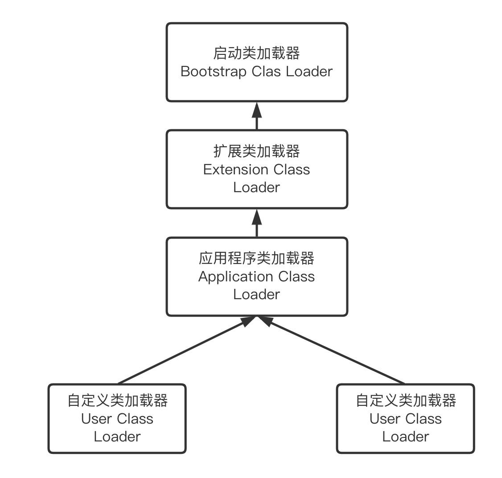
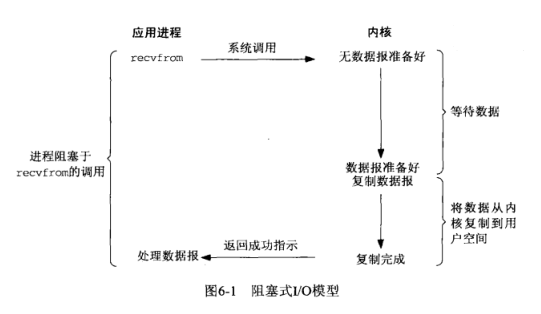
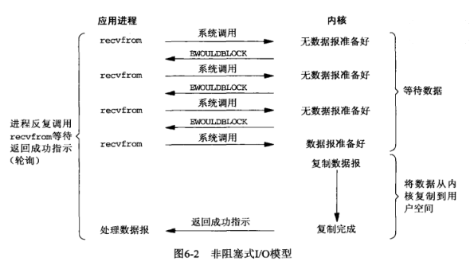
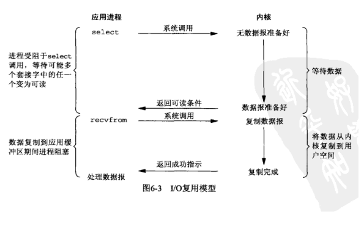
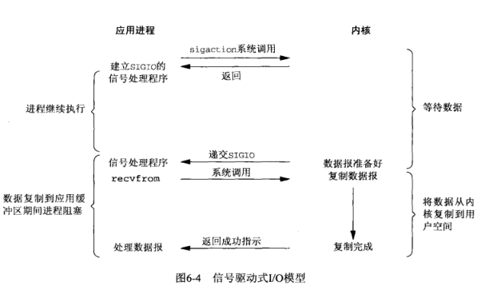
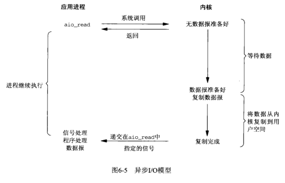

[TOC]

#  计算机网络

 

### 1 为什么三次握手（三次握手和四次挥手）

保证双方确认自己的发送能力和接收能力都正确

如果两次握手，发送方重传了SYN报文，在正常数据交流后关闭连接后，接收方收到了之前重传的SYN报文，会发送一个确认报文并建立连接

### 2 GET和POST的区别

GET参数带在URL中，长度受限于浏览器和服务端的规定，

GET会自动缓存和记录在浏览器历史中，会受到CSRF攻击

GET产生一个TCP数据包，同时发送请求头和请求体，POST先发送header再发送body

### 3 如何优雅的谈论HTTP1.0 1.1 2.0 3.0

**HTTP1.0**每次请求都是短连接，会重复创建新的TCP连接

**HTTP1.0**最受诟病的就是**连接无法复用** 和 **head of line blocking队头阻塞**

> 队头阻塞的简单定义就是当单个（慢）对象阻止其他/后续的对象前进

**HTTP1.1**支持长链接，减少了建立和关闭连接的消耗

**HTTP1.1**支持流水线式请求，客户端不需要等待应答即可发送下一次请求，但服务端必须按顺序返回相应结果（所以依然会有队头阻塞）

**HTTP1.1**也增加了一些额外的功能来增加性能，HTTP1.1增加HOST请求头，Connection：keep-alive请求头支持长链接，增加RANGE字段支持断点续传，增加Cache缓存相关字段

> HTTP1.1是一个纯文本协议，无法进行多路复用同时传输多个资源（https://zhuanlan.zhihu.com/p/330300133）（队头阻塞问题），HTTP1.1可以通过打开多个TCP连接的方式缓解队头阻塞的问题，但不好扩展

**HTTP2**加入了二进制分帧层，在TCP报文间加入了stream id（流id）和length来区分HTTP资源，同一个资源的分帧拥有一样的stream id，接收方就可以根据stream id来区分资源，而不同的资源就可以这样在tcp连接中多路复用的传输下去，而分帧之后也利于上层应用协议实现不同的调度算法

> HTTP2虽然解决了应用层级别的队头阻塞，但无法解决传输层TCP的队头阻塞，但TCP级别的丢包影响相对较小，而在一些丢包率较高的网络上，6个HTTP1.1的连接或许比1个HTTP2.0的连接更为高效

**HTTP3**使用了全新的传输层协议，QUIC，QUIC是构建于UDP之上的可靠传输协议，在HTTP2的基础上在每个数据帧中加入了字节范围，若某个包丢失，而其他包已经携带了正确顺序的其他stream id的数据，则不会阻塞

### 4 HTTPS

> 验证证书

客户端拿到证书后，可以基于CA机构的公钥来对证书数字签名进行解密，然后通过证书的hash算法计算出证书内容的hash，比较解密值和hash值即可确认证书是否被篡改过

> HTTPS 流程

客户端发送client hello，并附带自己的加密套件和加密算法，并附带第一随机数

服务端收到后发送server hello，告知客户端选择的加密算法，附带第二随机数

服务端继续发送自己的证书和公钥

服务端发送server hello done

客户端收到证书后验证证书正确，随后生成预主秘钥（第三随机数），通过服务端公钥加密预主秘钥后发送到服务端

之后客户端和服务端都可以通过第一随机数、第二随机数和预主秘钥来计算得到会话秘钥，会话过程通过会话秘钥完成对称加密

### 5 jwt

header.payload.signature

### 6 TCP可靠传输 流量控制 拥塞控制

**可靠传输 ** 通过四种方式实现：校验、序号、确认、重传

**流量控制** 

接收方维护接收窗口rwnd，接收方根据自己的接收能力，来做流量控制，接收窗口通过累积确认，当数据包丢失时，只要求发送方选择重传丢失的数据包

拥塞窗口（cwnd），根据网络拥塞程度设置的窗口值，发送窗口= min{rwnd，cwnd}

**拥塞控制**

* 慢开始 每个RTT中，每个确认的报文都会使cwnd+1，这样cwnd会以指数级增长
* 拥塞避免 当cwnd值增加到超过拥塞避免阈值ssthresh时，进入拥塞避免算法，每个RTT只会让cwnd+1。
* 当拥塞发生时（第一个丢包事件），将cwnd置为1，ssthresh置位之前cwnd的一半
* 发送端收到三个冗余ACK会快重传，并进入快速恢复状态，快恢复将ssthresh减半，并使用拥塞避免算法线性增加cwnd

https://zhuanlan.zhihu.com/p/59656144

### 7 ARP协议  NAT协议（待完善）

作者：牛客698656726号
链接：https://www.nowcoder.com/discuss/833962?type=all&order=recall&pos=&page=1&ncTraceId=&channel=-1&source_id=search_all_nctrack&gio_id=E3DC3C456A1E3196C87D463B2B5EB059-1644546924960
来源：牛客网

ARP解决了同一个局域网上的主机和路由器IP和MAC地址的解析。

- 每台主机都会在自己的ARP缓冲区中建立一个ARP列表，以表示IP地址和MAC地址的对应关系。 
- 当源主机需要将一个数据包要发送到目的主机时，会首先检查自己 ARP列表中是否存在该 IP地址对应的MAC地址，如果有，就直接将数据包发送到这个MAC地址；如果没有，就向本地网段发起一个ARP请求的广播包，查询此目的主机对应的MAC地址。此ARP请求数据包里包括源主机的IP地址、硬件地址、以及目的主机的IP地址。 
- 网络中所有的主机收到这个ARP请求后，会检查数据包中的目的IP是否和自己的IP地址一致。如果不相同就忽略此数据包；如果相同，该主机首先将发送端的MAC地址和IP地址添加到自己的ARP列表中，如果ARP表中已经存在该IP的信息，则将其覆盖，然后给源主机发送一个 ARP响应数据包，告诉对方自己是它需要查找的MAC地址。 
- 源主机收到这个ARP响应数据包后，将得到的目的主机的IP地址和MAC地址添加到自己的ARP列表中，并利用此信息开始数据的传输。 
- 如果源主机一直没有收到ARP响应数据包，表示ARP查询失败。

### 8 csrf、xss、SYN泛洪、SQL注入，DNS劫持、DNS污染（这部分待完善）

https://tech.meituan.com/2018/10/11/fe-security-csrf.html

https://tech.meituan.com/2018/09/27/fe-security.html

CSRF 跨站请求伪造，自动防御策略：同源检测，主动防御策略：Token验证

XSS 跨站脚本攻击，模板引擎，避免内联，避免拼接HTML

##### SYN泛洪攻击

指发起大量三次握手仅第一次的TCP连接请求，而不回应服务端的第二次握手，会让服务端半连接队列保存大量的半连接，耗尽服务器性能，解决方法：

1. 扩大半连接队列，换汤不换药
2. 覆盖最早的半连接，种策略要求合法连接可以在比可以填充恶意SYN数据包的积压时间更短的时间内完全建立
3. **SYN Cookie ** SYN Cookie是对TCP[服务器](https://baike.baidu.com/item/服务器/100571)端的[三次握手协议](https://baike.baidu.com/item/三次握手协议/6042714)作一些修改，专门用来防范SYN Flood攻击的一种手段。它的原理是，在TCP服务器收到TCP SYN包并返回TCP SYN+ACK包时，不分配一个专门的数据区，而是根据这个SYN包计算出一个cookie值。在收到TCP ACK包时，TCP服务器再根据那个cookie值检查这个TCP ACK包的合法性。如果合法，再分配专门的数据区进行处理未来的TCP连接。

### 9 HTTP缓存（待完善）

### 10 大量Socket处于Time-Wait状态（待完善）

### 11 Time-wait和Close-wait

##### 为什么要有Time-wiat

1. 我们无法保证四次挥手的最后一次ACK可以被正确传输
2. 网络上可能会有残留的数据包

time-wait就是用来解决这两个问题的

第一点time-wait设置了一个2MSL的定时器，如果服务器没有收到第四次挥手ACK的内容，重传了第三次挥手的报文，在time-wait状态客户端仍然可以响应正确的报文。如果没有time-wait，客户端直接进入close状态，如果收到了重传的报文，会回复一个RST数据报，服务器就无法按照正常的流程进入close状态。

第二点假如现在有一个新的连接建立起来，使用的IP地址与之前的端口完全相同，现在建立的一个连接是之前连接的完全复用，我们还假定之前连接中有数据报残存在网络之中，这样的话现在的连接收到的数据有可能是之前连接的报文。

##### 为什么是2MSL

之所以是两倍的MSL，是由于MSL是一个数据报在网络中单向发出 到认定丢失的时间，即(Maximum Segment Lifetime)报文最长存活时间，一个数据报有可能在发送途中或是其响应过程中成为残余数据报，确认一个数据报及其响应的丢弃需要两倍的MSL

##### time-wait过多怎么办

在高并发短连接的服务器上很容易出现time-wait过多的问题，可以通过调整内核参数来降低或解决

**net.ipv4.tcp_syncookies = 1**

表示开启SYN Cookies。当出现SYN等待队列溢出时，启用cookies来处理，可防范少量SYN攻击，默认为0，表示关闭；

**net.ipv4.tcp_tw_reuse = 1**

表示开启重用。允许将TIME-WAIT sockets重新用于新的TCP连接，默认为0，表示关闭；

**net.ipv4.tcp_tw_recycle = 1**

表示开启TCP连接中TIME-WAIT sockets的快速回收，默认为0，表示关闭。

系统tcp_timestamps缺省就是开启的，所以当tcp_tw_recycle被开启后，实际上这种行为就被激活了.如果服务器身处NAT环境，安全起见，通常要禁止tcp_tw_recycle，至于TIME_WAIT连接过多的问题，可以通过激活tcp_tw_reuse来缓解。

**net.ipv4.tcp_max_tw_buckets = 5000**

表示系统同时保持TIME_WAIT套接字的最大数量，如果超过这个数字，TIME_WAIT套接字将立刻被清除并打印警告信息。默认为180000，改为 5000。对于Apache、Nginx等服务器，上几行的参数可以很好地减少TIME_WAIT套接字数量，但是对于Squid，效果却不大。此项参数可以控制TIME_WAIT套接字的最大数量，避免Squid服务器被大量的TIME_WAIT套接字拖死。

**net.ipv4.tcp_max_syn_backlog = 8192**

表示SYN队列的长度，默认为1024，加大队列长度为8192，可以容纳更多等待连接的网络连接数。

**net.ipv4.tcp_keepalive_time = 1200**

表示当keepalive起用的时候，TCP发送keepalive消息的频度。缺省是2小时，改为20分钟。

**net.ipv4.ip_local_port_range = 1024 65000**

表示用于向外连接的端口范围。缺省情况下很小：32768到61000，改为1024到65000。

### 12 网络的整体流程（非常好的知乎文章）

https://www.zhihu.com/question/21546408

### 13 TCP首部和UDP首部

### 14 CDN内容分发网络 （自顶向下P100）

### 15 TCP和Socket对应过程

# Spring

### Spring IOC的理解

IOC控制反转，DI依赖注入

Spring使用map容器存储对象，Spring IOC容器有三级缓存，SingletonObjects、earlySingtonObjects、SingletonFactory分别存储成品对象、半成品对象、Lambda表达式

另外bean都是通过反射创建的，还可以实现BeanPostProcessor接口或BeanFactoryPostProcessor接口来对Bean或BeanFactory进行扩展

### Spring bean生命周期

Spring管理了整个Bean的生命周期，从产生到销毁：

1. 当我们要使用一个Bean，或者Spring容器自带的Bean初始化时，会通过反射使用CreateBeanInstance来生成该Bean
2. 当Bean对象创建完成之后，要开始给Bean填充属性，Spring通过populateBean方法来完成对Bean属性的填充，这里可能会涉及循环依赖问题
3. 调用invokeAwareMethods方法向Bean对象注入依赖的容器对象
4. 调用BeanPostProcessor的前置处理方法来进行Bean对象的扩展，例如ApplicationContextPostProcesor和EmbeddValueResolver等对象
5. 调用invokeInitMethods方法来完成初始化方法的调用，在这个过程中，判断Bean对象是否实现了InitializingBean接口，如果实现了，调用afterPropertiesSet方法来最后设置Bean对象
6. 调用BeanPostProcessor的后置处理方法扩展Bean，aop在此处实现
7. 获取到完整对象，通过getBean的方式去进行对象的获取和使用
8. 对象使用完成后，容器在关闭的时候，会 销毁对象，判断对象是否实现了DispoableBean接口，然后去调用destoryMethod方法

### BeanFacotry和FactoryBean的区别

BeanFactory和FactoryBean都可以用来创建对象，只不过创建的流程和方式不同，使用BeanFactory会严格遵照Bean生命周期，经过一系列复杂步骤之后会创建出单例对象，流水线式创建过程

而FactoryBean是用户可以自定义Bean对象的创建流程，不需要按照bean的生命周期来创建，在此接口中包含了三个方法，isSingleton，getObjectType，getObject

BeanFactory是直接访问Spring容器的接口

　BeanFactory，以Factory结尾，表示它是一个工厂类(接口)， **它负责生产和管理bean的一个工厂**。在Spring中，**BeanFactory是IOC容器的核心接口，它的职责包括：实例化、定位、配置应用程序中的对象及建立这些对象间的依赖。BeanFactory只是个接口，并不是IOC容器的具体实现，但是Spring容器给出了很多种实现，如 DefaultListableBeanFactory、XmlBeanFactory、ApplicationContext等，其中****XmlBeanFactory就是常用的一个，该实现将以XML方式描述组成应用的对象及对象间的依赖关系**。XmlBeanFactory类将持有此XML配置元数据，并用它来构建一个完全可配置的系统或应用。  

**一般情况下，Spring通过反射机制利用<bean>的class属性指定实现类实例化Bean，在某些情况下，实例化Bean过程比较复杂，如果按照传统的方式，则需要在<bean>中提供大量的配置信息。配置方式的灵活性是受限的，这时采用编码的方式可能会得到一个简单的方案。Spring为此提供了一个org.springframework.bean.factory.FactoryBean的工厂类接口，用户可以通过实现该接口定制实例化Bean的逻辑。FactoryBean接口对于Spring框架来说占用重要的地位，Spring自身就提供了70多个FactoryBean的实现**。它们隐藏了实例化一些复杂Bean的细节，给上层应用带来了便利。从Spring3.0开始，FactoryBean开始支持泛型，即接口声明改为FactoryBean<T>的形式

以Bean结尾，表示它是一个Bean，不同于普通Bean的是：它是实现了FactoryBean<T>接口的Bean，根据该Bean的ID从BeanFactory中获取的实际上是FactoryBean的getObject()返回的对象，而不是FactoryBean本身，如果要获取FactoryBean对象，请在id前面加一个&符号来获取。

简单来说，BeanFactory是Bean工厂，负责生产和管理Bean和访问容器，FactoryBean是一种特殊的实现了FactoryBean接口的Bean，根据这个Bean的id从BeanFactory中获取的实际上是getObject方法返回的Bean，如果要获取这个FactoryBean本身，需要在id前加&符号

### BeanFactory和ApplicationContext的区别

BeanFactory是最基本的Spring 访问IOC容器的根接口，里面只是某些基本方法的定义和规范，ApplicationContext则是在此之上的更高级的接口，进一步扩展了其功能，包括BeanPostProcessor和BeanFactoryPostProcessor以及其他特殊类型Bean的自动识别，容器启动后Bean的自动初始化、国际化支持、容器内事件发布，统一资源加载策略等功能

### 三级缓存解决循环依赖，为什么需要第三级缓存

https://segmentfault.com/a/1190000023647227

第三级缓存放的是一个lambda表达式，该表达式会在Bean实例化的过程中被调用，如果该Bean进入了第三级缓存且需要被实例化，该方法会判断是否需要为该Bean创建代理对象，需要则创建代理对象，完成后移入第二级缓存并从第三级缓存移出。

### SpringBoot启动流程

自动装配的实现原理：

1. 当启动SpringBoot应用程序时，会通过SpringApplication的run方法执行，在该对象的构造方法中会进行一系列的初始化工作，例如初始化监听器，在这个过程中会加载所有的spring.factories文件，放入缓存中等待使用
2. 对象构造方法完成后执行run方法，首先是上下文对象的创建，banner打印等工作，然后进入重要的refreshContext和prepareContext方法，在这两个步骤中完成了自动装配的核心功能
3. prepareContext中完成了对上下文Context对象的初始化工作，然后通过load方法将SpringApplication启动类注册到容器中，方便之后解析该类获得@SpringBootApplication和@EnableAutoCOnfiguration等注解并解析
4. 在refreshContext方法中会进行整个容器的刷新，调用spring中的refresh方法，在refresh方法中，会调用invokeBeanFactoryPostProcessor方法，该方法处理ConfigurationClassPostProcessor，该方法会解析启动类上的主要注解，包括@ComponentScan、@Bean、@Import等注解
5. 解析@Import注解时，会拿到启动类上的所有@import注解，之后会调用deferredImportSelectorHandler的process方法，完成对EnableAutoConfiguration的加载

### @Autowired @Resource等注解的区别

@Autowired和@Resource大致相同，都可以完成Bean的注入，@Autowired是Spring提供的注解，@Resource是J2EE提供的注解，Spring支持该注解的导入，@Autowired按类型导入Bean，@Resource按name和类型导入Bean

### Spring事务

Spring事务通过ThreadLocal传递类Connection对象，无论任何持久层框架要获取Connection，都可以从当前绑定线程的ThreadLocal中获取，通过这种方式传递Connection可以使数据库连接和线程相绑定，实现跨类和方法（不同的Service和Dao）的传递，更容易实现事务的传播行为

另外，Spring抽象了DataSourceUtils来进行对connection的管理，DataSourceUtils会从类似TransactionResourceManager的类获取Connection资源，并隐藏了不同持久层框架开启或关闭事务的细节

**Spring事务传播行为**

1 REQUIRED：必需的（默认值）
如果当前没有事务运行，则会开启一个新的事务；如果当前已经有事务运行，则方***运行在当前事务中，“你没有，我开启，你有了，我加入”
2 REQUIRES_NEW：新事务
如果当前没有事务事务运行，则会开启一个新的事务；如果当前已经有事务运行，则会将原事务挂起，重新开启一个新的事务。当新的事务运行完毕后，再将原来的事务释放，“你没有我开启，你有了我造新的”
3 SUPPORTS：支持
如果当前有事务运行，则方法运行在当前事务中；如果没有事务运行，则不在事务中运行，“有就有，没有拉到”
4 NOT_SUPPORTED：不支持
如果当前事务运行，则会将事务挂起，如果当前没有事务运行，则它也不会运行在事务中，“有我不要，没有正好”
5 MANDATORY：强制
当前方法必须在事务中，如果没有事务，则直接抛出异常，“要干活必须有，没有就打死不干”
6 NEVER：不允许
当前方法不允许运行在事务中，如果当前已经有事务运行，则抛出异常，“要干活不准有，有了不干活”
7 NESTED：嵌套
如果当前没有事务运行，则开启一个新的事务；如果当前已经有事务运行，则会记录一个保存点，并继续运行在当前事务中。如果子事务运行中出现异常，则不会全部回滚，而是回滚到哦上一个保存点

### Spring MVC流程

所有的请求发送给DispatcherServlet进行处理，DispatcherSerclet去请求HandlerMapping，找出容器中被@Controller注解修饰的Bean以及被@RequestMapping修饰的方法，生成Handler和HandlerInterceptor封装起来并以HandlerExcutionChain对象返回，之后DispatcherServlet会将HandlerExcutionChain发送给HandlerAdaptor，通过HandlerAdaptor执行Handler的方法，执行完成后返回ModelAndView对象，DispatcherServlet会把ModelAndView发送给ViewResolver进行解析，解析完成后返回View对象，并进行渲染发送给客户端

### Spring Bean作用域

| 作用域         | 描述                                                         |
| -------------- | ------------------------------------------------------------ |
| singleton      | 在spring IoC容器仅存在一个Bean实例，Bean以单例方式存在，默认值 |
| prototype      | 每次从容器中调用Bean时，都返回一个新的实例，即每次调用getBean()时，相当于执行newXxxBean() |
| request        | 每次HTTP请求都会创建一个新的Bean，该作用域仅适用于WebApplicationContext环境 |
| session        | 同一个HTTP Session共享一个Bean，不同Session使用不同的Bean，仅适用于WebApplicationContext环境 |
| global-session | 一般用于Portlet应用环境，该作用域仅适用于WebApplicationContext环境 |

# 数据库

### 范式

**第一范式** 列不可再分

**第二范式** 非主属性必须依赖于主属性，而不能依赖于主属性的一部分

**第三范式** 数据表中如果不存在非关键字段对任一候选关键字段的传递函数依赖则符合第三范式。简而言之，第三范式就是属性不依赖于其它非主属性

https://blog.csdn.net/ljp812184246/article/details/50706596

**BCNF** 即在第三范式的基础上，数据库表中如果不存在任何字段对任一候选关键字段的传递函数依赖则符合鲍依斯-科得范式。

### MyISAM 和 InnoDB区别

##### 2.1、MyISAM与InnoDB区别

-  InnoDB聚簇索引，MyISAM非聚簇索引 
-  InnoDB数据与索引一起保存.ibd，MyISAM表结构.frm 索引.myi 数据.myd 
-  InnoDB支持事务、外键、行锁表锁，MyISAM不支持事务、外键、只支持表锁 
-  select count(*) 
-  MyISAM查询更优，InnoDB更新更优 
-  都是B+tree索引 
-  MyISAM支持全文索引，InnoDB5.6后支持 

#####  2.2、MyISAM

-  不支持事务，但是每次查询都是原子的 
-  支持表级锁，每次操作对整个表加锁 
-  存储表的总行数 
-  一个MyISAM表有三个文件：表结构.frm 索引.myi 数据 .myd 
-  采用非聚集索引，索引文件的数据域存储指向数据文件的指针。辅索引与主索引基本一致，但是辅索引不用保证唯一性。 

#####  2.3、Innodb

-  支持ACID事务，支持四种隔离级别
-  支持行级锁及外键约束，因此支持写并发 
-  不存储总行
-  主键索引采用聚集索引(索引的数据域存储数据文件本身)，辅索引的数据域存储主键的值;因此从辅索引查找数据，需要先通过辅索引找到主键值，再访问辅索引；最好使用自增主键，防止插入数据时，为维持B+树结构，文件的大调整。

### 自增主键不连续的可能性

1. 事务回滚不会回滚自增主键，因为并发环境下可能会主键冲突
2. MySQL5.7之前自增主键存放在内存中，没有持久化，重启之后会根据目前的主键值修改表的AUTO_INCREMENT，MySQL8.0之后将自增主键变更记录在了redo log中，重启靠redo log恢复
3. 唯一键冲突导致的插入失败还是会消耗自增主键值（在公司实习遇到过的经典问题）

### 为什么推荐使用自增主键

①主键页就会近乎于顺序的记录填满，提升了页面的最大填充率，不会有页的浪费。 

 ②新插入的行一定会在原有的[最大数]()据行下一行，mysql定位和寻址很快，不会为计算新行的位置而做出额外的消耗。 

 ③减少了页分裂和碎片的产生 

 UUID：**大量的随机IO**+**页分裂导致移动大量的数据**+数据会有碎片。 

 总结：自增ID有序，会按顺序往最后插入，而UUID无序，随机生成，随机插入，会造成频繁页分裂，内存碎片化，大量随机IO

### B+树、B树、红黑树在数据库层面的区别

B+树：非叶子结点不存data，只存key，查询更稳定，增大了广度(B+树出度更大，树高矮，节点小，磁盘IO次数少)；叶子结点下一级指针（范围查询）；索引冗余。 

 与[红黑树]()相比：

更少查询次数：B+树出度更大，树高更低，查询次数更少 

 磁盘预读原理：为了减少IO操作，往往不严格按需读取，而是预读。B+树叶子**结点存储相临**，**读取会快一些**。 

 **存储更多索引结点：**B+树只在叶子结点储存数据，非叶子结点存索引，而一个结点就是磁盘一个内存页，内存页大小固定，那么相比B树这些可以·存更多的索引结点，出度更大，树高矮，查询次数少，磁盘IO少。 

### MySQL架构和一条SQL语句的执行流程

mysql分为server层与存储引擎层，server层包含连接器、分析器、优化器、执行器

 接下来以一条sql查询语句执行过程介绍各个部分功能。客户端执行一条sql： 

 1、首先由连接器进行**身份验证，权限管理** 

 2、若开启了缓存，会**检查缓存**是否有该sql对应结果（缓存存储形式key-vlaue，key是执行的sql，value是对应的值）若开启缓存又有该sql的映射，将结果直接返回； 

 3、分析器进行**词法语法分析** 

 4、优化器会**生成执行计划**、选择索引等操作，选取最优执行方案 

 5、然后来到执行器，打开表调用存储引擎接口，逐行判断是否满足查询条件，满足放到结果集，最终返回给客户端；若用到索引，筛选行也会根据索引筛选。 

           图1、  一条sql语句执行流程

### 隔离级别和解决原理

**读未提交**：原理：直接读取数据，不能解决任何并发问题 

**读已提交**：读操作不加锁，写操作加排他锁，解决了脏读。原理：利用MVCC实现，每一句语句执行前都会生成Read View（一致性视图） 

**可重复读**：MVCC实现，只有事务开始时会创建Read View，之后事务里的其他查询都用这个Read View。解决了脏读、不可重复读，快照读（普通查询，读取历史数据）使用MVCC解决了幻读，当前读（读取最新提交数据）通过间隙锁解决幻读（lock in share mode、for update、update、detete、insert），间隙锁在可重复读下才生效。（**默认隔离级别**） 

 **可串行化**：原理：使用锁，读加共享锁，写加排他锁，串行执行

**Read View**读已提交隔离级别下，会在每次查询都生成一个Read View，可重读读只在事务开始时生成一个Read View，以后每次查询都用这个Read View，以此实现不同隔离界别。

### RR隔离级别可以完全解决幻读吗

不可以，如果事务A开启事务，执行快照读，再执行当前读。在快照读和当前读之间事务B插入了一条数据，那么事务A会读到幻行

### MVCC原理

https://zhuanlan.zhihu.com/p/52977862

innodb数据表每行记录含有3个隐藏字段，row_id,事务id，回滚指针，row_id用于在没有给表指定主键的情况下设置为默认的主键（聚簇索引）

在innodb 中每个事务开启后都会得到一个read_view。副本主要保存了当前数据库系统中正处于活跃（没有commit）的事务的ID号，其实简单的说这个副本中保存的是系统中当前不应该被本事务看到的其他事务id列表。

readView包含当前系统活跃的未提交的事务版本号集合、最小活跃事务id和最大活跃事务id，以及创建当前的readView的事务id

### 倒排索引（全文索引）

Mysql技术内幕 P232

简单来说，对于文档型内容要进行搜索，需要建立倒排索引

例如，正常的索引顺序是由 文档id -> 找到文档内容

倒排索引将文档内容分词后存储到一张辅助表中，建立由文档内的单词 -> 存储过这个单词的文档id的索引，以此来搜索该单词在哪些文档中出现过

### WAL 和 Redolog Binlog两阶段提交

WAL是为了redolog的持久性，可以通过参数配置，默认为1，每次事务都会将redolog buffer 写入 os buffer并调用fsync刷盘

https://zhuanlan.zhihu.com/p/58011817

两阶段提交是为了保证redolog和binlog的一致性，若redolog和binlog由于断电原因导致不一致，那么主从备份的数据将不一致

https://cloud.tencent.com/developer/article/1790507

# redis

### SDS 简单动态字符串

比起C的普通字符串，SDS增加了len和free字段，可以常数获取字符串已用长度和剩余可用长度

SDS使用**空间预分配** 和 **惰性空间分配**

空间预分配会在分配SDS空间时，若SDS小于1MB，则多分配一倍（和len相同长度的缓冲空间），若SDS大于1MB，每次多分配1MB空间

惰性空间释放即在SDS缩短时不释放字符串空间，用户有需要需要手动释放空间

### 字典（哈希表）

redis字典使用常规哈希表实现，哈希冲突通过链地址法解决

redis字典实际上保存了一个长度为2的哈希表数组，用于rehash扩容，另外redis的哈希表有缩容操作，当负载因子小于0.1时会缩容

redis rehash操作也并不复杂，当进行扩容时，会进行渐进式rehash：

1. 为数组中ht[1]分配空间
2. 将保存在ht[0]中的节点rehash到ht[1]中，这部分是渐进式的
3. 当迁移完毕后，释放ht[0],并在ht[1]新建一个空白hash表

### 跳表

redis跳表由以下几部分构成： 后退指针（只能后退一层），分值，储存的成员对象，层数组（每个层包括前进指针和跨度）

没创建一个新的跳表节点，都会根据幂次定律随机生成一个1-32之间的随机数作为level数组的大小，因此可以认为前进指针的生成是偏小均匀的

跳表的时间复杂度是平均Ologn，最坏复杂度是On

### 整数集合、压缩列表（略）

### 五种基本数据类型和底层实现

作者：方圆想当图灵
链接：https://www.nowcoder.com/discuss/634573?channel=-1&source_id=profile_follow_post_nctrack
来源：牛客网

String类型
编码格式：int，embstr，raw
int保存的是可以用long类型保存的整数
embstr保存的是字符串长度小于等于39字节的短字符串
raw保存字符串大于39字节
其中embstr和raw使用的都是SDS（简单动态字符串类型），它的底层是一个字符数组，其中存有字符串长度和字符数组中未使用的长度
long和double类型也作为字符串类型保存，对其进行操作时会转换为浮点数，再转为字符串存起来 

List类型
编码格式ziplist（压缩列表），linkedlist（双端[链表]()）
ziplist是在节点数小于512个且每个字符长度小于64字节时使用，它是一种连续内存的顺序型数据结构
linkedlist，具有双端列表的特性 

hash类型
编码格式：ziplist，hashtable
ziplist要求数量小于512个，键和值长度小于64字节，键和值紧挨着连续存储，用两个节点
hashtable，使用map作为底层实现 

set类型
编码格式：intset，hashtable
intset要求元素都是整数，且小于512个
hashtable只使用字典的key，而value值为null 

zset类型（这个被问的几率大一些）
编码格式：ziplist和skiplist
ziplist要求数量小于512，元素大小小于64字节，每个元素用两个紧挨着的压缩列表节点，第一个保存元素的成员，第二个保存分值，并会从小到大的顺序[排序]()，分值较小的放置在靠近表头的位置
skpilist使用的是map和跳表两种数据结构，它们共享zset中的对象，不会复制元素而造成浪费
map的作用是能够以O（1）的时间复杂度来获取对象的score，键时元素成员，值是元素的分值（ZSCORE命令）
跳表是有序的数据结构，对象不可重，分值可重，分值重的按对象大小[排序]()，每个节点都有一个随机的层高，每层保留前往下一个节点的指针和跨度，能够进行快速匹配，调用zrank和zrange进行范围操作

### redis为什么用跳表不用红黑树

https://stackoverflow.com/questions/45115047/why-redis-sortedset-uses-skip-list-instead-of-balanced-tree

原作者回答： 

1. 跳表并不是很占内存，而且修改前进指针生成的密度可以使内存密集度低于bTree
2. 有序列表经常需要zRange操作，使用跳表效率更高
3. 跳表更容易实现、更改、维护

### Redis集群

https://zhuanlan.zhihu.com/p/337052900?utm_source=wechat_session&utm_medium=social&utm_oi=821132514470002688&utm_campaign=shareopn

# MQ

## Rocket MQ

https://github.com/apache/rocketmq/tree/master/docs/cn

看看官方文档吧就……以后再慢慢研究

### Push、Pull、long-polling

https://www.cnblogs.com/hzmark/p/mq_push_pull.html

**Push**主动推送消息，优点是有消息立即推送，实时性强

缺点是

Broker需要维护Consumer状态和偏移量，不利于Broker支持大量Consumer

Consumer消费速度不一致，Broker推送难以处理不同的Consumer状况

Consumer如果出现宕机等无法消费的情况，Broker难以处理

大量推送消息会加重consumer负载或冲垮Consumer

**Pull**轮询拉消息，优点在于Broker不再需要维护Consumer状态，Consumer可以根据自身状况来规划消费消息

缺点：

Pull会产生时延，无法保证消息一到Broker就立刻消费

Pull执行频率问题

**long-polling** 长轮询，Consumer发起pull请求后，Broker接收到请求后会持有这个请求一段时间，如果这段时间内有消息到了，就立刻返回给Consumer消费，如果这段时间没有消息到，等到时间超时后Broker也会返回一个响应给Consumer，Consumer接收到这个响应后会再发起pull请求。

### 事务消息消费过程

RocketMQ只保证事务消息的     本地事务和消息投递的原子性，不处理消费方消息失败的情况

# Java

### JAVA为什么是单继承

> Java类继承是单继承，但是可以实现多个接口，接口可以继承接口，接口可以多继承接口

Java只能单继承是为了避免多重继承陷阱（菱形继承），多重继承的情况下，如果多个父类有同一个方法，难以确认具体继承哪个方法（C++有多重继承陷阱）

### ThreadLocal

https://segmentfault.com/a/1190000022704085

### AQS

### 线程池原理

线程池在内部实际上构建了一个生产者消费者模型，将线程和任务两者解耦，并不直接关联，从而良好的缓冲任务，复用线程。线程池的运行主要分成两部分：任务管理、线程管理。任务管理部分充当生产者的角色，当任务提交后，线程池会判断该任务后续的流转：（1）直接申请线程执行该任务；（2）缓冲到队列中等待线程执行；（3）拒绝该任务。线程管理部分是消费者，它们被统一维护在线程池内，根据任务请求进行线程的分配，当线程执行完任务后则会继续获取新的任务去执行，最终当线程获取不到任务的时候，线程就会被回收。

### 线程池参数如何量化设计

https://blog.csdn.net/riemann_/article/details/104704197

### 为什么OOM后进程还能继续执行

OOM可以被catch，OOM会导致发生OOM异常的线程终结掉，该线程引用的资源会被gc回收

### Java IO

https://www.bilibili.com/video/BV1Vy4y1J7DG?p=7

这个视频的IO讲的挺好的

### HashMap为什么红黑树阈值是8

首先和hashcode碰撞次数的泊松分布有关，主要是为了寻找一种时间和空间的平衡。在负载因子0.75（HashMap默认）的情况下，单个hash槽内元素个数为8的概率小于百万分之一，将7作为一个分水岭，等于7时不做转换，大于等于8才转红黑树，小于等于6才转链表。链表中元素个数为8时的概率已经非常小，再多的就更少了，所以原作者在选择链表元素个数时选择了8，是根据概率统计而选择的。

红黑树中的TreeNode是链表中的Node所占空间的2倍，虽然红黑树的查找效率为o(logN)，要优于链表的o(N)，但是当链表长度比较小的时候，即使全部遍历，时间复杂度也不会太高。所以，要寻找一种时间和空间的平衡，即在链表长度达到一个阈值之后再转换为红黑树。

之所以是8，是因为Java的源码贡献者在进行大量实验发现，hash碰撞发生8次的概率已经降低到了0.00000006，几乎为不可能事件，如果真的碰撞发生了8次，那么这个时候说明由于元素本身和hash函数的原因，此次操作的hash碰撞的可能性非常大了，后序可能还会继续发生hash碰撞。所以，这个时候，就应该将链表转换为红黑树了，也就是为什么链表转红黑树的阈值是8。 最后，红黑树转链表的阈值为6，主要是因为，如果也将该阈值设置于8，那么当hash碰撞在8时，会反生链表和红黑树的不停相互激荡转换，白白浪费资源。

### Java 集合

List： ArrayList、vector、CopyOnWriteArrayList

Set： HashSet

Map： HashMap、ConcurrentHashMap、HashTable、TreeMap

### 锁类型

#### 公平锁

公平锁：多个线程按照申请锁的顺序去获得锁，线程会直接进入队列去排队，永远都是队列的第一位才能得到锁。

优点：所有的线程都能得到资源，不会饿死在队列中。
缺点：吞吐量会下降很多，队列里面除了第一个线程，其他的线程都会阻塞，cpu唤醒阻塞线程的开销会很大。

#### 非公平锁

非公平锁：多个线程去获取锁的时候，会直接去尝试获取，获取不到，再去进入等待队列，如果能获取到，就直接获取到锁。

优点：可以减少CPU唤醒线程的开销，整体的吞吐效率会高点，CPU也不必取唤醒所有线程，会减少唤起线程的数量。
缺点：你们可能也发现了，这样可能导致队列中间的线程一直获取不到锁或者长时间获取不到锁，导致饿死。

#### 乐观锁

乐观锁是一种乐观思想，即每次处理共享数据时都默认别的线程都不会在进行修改，在写数据时会判断当前数据与期望值是否相同，如果相同才会更新。适用于读多写少的场景。

在 Java 中的乐观锁使用最多的的就是 CAS （Compare And Swap）方法，即比较与判断。

CAS 的缺点

- ABA 问题
- 循环时间长开销大

CAS 在更新失败是会不停循环执行知道成功，如果长时间不成功会给 CPU 带来非常大的执行开销。

- 只能保证一个共享变量的原子操作

当对一个共享变量执行操作时，我们可以使用循环CAS的方式来保证原子操作，但是对多个共享变量操作时，循环CAS就无法保证操作的原子性，这个时候就可以用锁，或者有一个取巧的办法，就是把多个共享变量合并成一个共享变量来操作。

#### 悲观锁

悲观锁是一种悲观思想，即每次操作共享变量时都认为会有其他线程会修改，所以每次操作前都会上锁，其他线程想操作共享变量时获取不到锁只能等待获取锁的线程释放锁。适用于写多读少的场景。

#### 读写锁

读写锁分为读锁和写锁，主要是为了解决锁的性能问题。读锁可以在没有写锁的时候被多个线程同时持有，写锁则是独占的（排他），即可以有多个线程并发的读，但是只能有一个线程写。

读写锁的互斥原则：

- 读读共存
- 读写互斥
- 写写互斥

#### 可重入锁

可重入锁，也叫做递归锁，是指在一个线程中可以多次获取同一把锁，比如：一个线程在执行一个带锁的方法，该方法中又调用了另一个需要相同锁的方法，则该线程可以直接执行调用的方法，即可重入，而无需重新获得锁。

可重入锁最大的作用是避免死锁。

可重入锁加锁几次就得释放锁几次，不然会导致死锁，例如加锁2次就得释放2次，如果只释放1次会导致程序卡死线程无法出来。

如果加锁1次释放两次运行时会报错。

[不可不说的Java“锁”事 - 美团技术团队 (meituan.com)](https://tech.meituan.com/2018/11/15/java-lock.html)

[5000字 | 24张图带你彻底理解Java中的21种锁 - 掘金 (juejin.cn)](https://juejin.cn/post/6867922895536914446)

·

### Java与C#泛型

Java是类型擦除式泛型，C#是具现化式泛型

C#的泛型无论在程序源码、编译后的中间语言，还是运行期，泛型都是切实存在的，List<int> List<string>就是两个类型

Java的泛型只在程序源码中存在，在编译后的字节码文件中会被替换为裸类型,List<Integer>和List<String>都会被替换为List类型，只是在编译后的字节码中，在元素修改、访问时自动插入一些类型转换和检查指令

显然Java这样做无法支持基本数据类型，因此Java的泛型强制只支持包装类型

# 设计模式

### 设计模式五大原则

https://blog.csdn.net/erlian1992/article/details/51151928

单一职责原则

开闭原则

里氏替换原则

依赖倒置原则

接口隔离原则

https://blog.csdn.net/zhengtuqi/category_9493651.html

迪米特法则

合成复用原则

# JVM

### full gc什么时候触发

1. 主动调用System.gc方法
2. 老年代空间不足
3. 方法区空间不足
4. Minor GC 分配担保空间不足
5. 堆中分配很大的对象

### Synchronized 底层原理 待深入

真正的深入操作系统级别的底层原理目前还没搞懂，暂时理解Monitor为一个操作系统级别的Mutex原语的争抢操作

### 为什么用元空间替代方法区（永久代）

https://blog.csdn.net/qq_38262266/article/details/107208357

元空间和永久代之间最大的区别在于：元空间并不在虚拟机中，而是使用本地内存

### 三色标记

《深入理解JVM虚拟机》P89

增量更新和原始快照

CMS基于增量更新来做并发标记，G1、Shenandoah根据原始快照来做并发标记

### 主流垃圾收集器介绍（待完善）

CMS、G1、Shenandoah、ZGC（染色指针）

###  类加载

加载 -> 连接 -> 初始化 -> 使用 -> 卸载
加载： 根据全限定名获取类的二进制字节流，存入方法区，并在堆中生成一个java.lang.Class对象作为方法区类的数据访问入口

验证：验证字节码安全，符合《Java虚拟机规范》

准备：为类变量（静态变量）分配内存赋初始值，jdk7以前静态变量存在方法区，jdk8之后类变量跟随Class对象一起存放在Java堆中

解析：将符号引用解析为直接引用

初始化：执行类构造器<client>()方法，client方法是编译器自动收集类中的所有类变量的赋值动作和静态语句块中的语句合并产生的

> 符合引用： 在java中，一个java类将会编译成一个class文件。在编译时，java类并不知道引用类的实际内存地址，因此只能使用符号引用来代替。比如org.simple.People类引用org.simple.Tool类，在编译时People类并不知道Tool类的实际内存地址，因此只能使用符号org.simple.Tool(假设)来表示Tool类的地址。而在类装载器装载People类时，此时可以通过虚拟机获取Tool类 的实际内存地址，因此便可以既将符号org.simple.Tool替换为Tool类的实际内存地址，及直接引用地址。（https://blog.csdn.net/yuyeqianhen/article/details/92619943）

#### 类加载器

启动类加载器加载<JAVA_HOME>\lib或-Xbootclasspath

扩展类加载器加载<JAVA_HOME>\lib\ext或java.ext.dirs

应用程序类加载器加载用户类路径 (Classpath) ，应用程序默认也使用这个类加载器

> 双亲委派模型：优先交给父类加载器去加载，只有父类加载器无法加载时，子类加载器才会自行去加载（保证了大量类的唯一性，类由全限定名和类加载器构成类的唯一性）

# 数据结构

### 为什么快排用的多于堆排

堆排比较的几乎都是内存不相邻的元素，对cache不友好

### 红黑树五个特性

1. 节点是红色或黑色。
2. 根是黑色。
3. 所有叶子都是黑色（叶子是NIL节点）。
4. 每个红色节点必须有两个黑色的子节点。（从每个叶子到根的所有路径上不能有两个连续的红色节点。）
5. 从任一节点到其每个叶子的所有[简单路径](https://zh.wikipedia.org/wiki/道路_(图论))都包含相同数目的黑色节点。

# 其他

### IO多路复用，epoll的触发方式，JAVA的IO模型

https://mp.weixin.qq.com/s/YdIdoZ_yusVWza1PU7lWaw

https://zhuanlan.zhihu.com/p/75716224

https://mp.weixin.qq.com/s/YdIdoZ_yusVWza1PU7lWaw

https://juejin.cn/post/6844904073276162055

**1.水平触发的时机 **

1. 对于读操作，只要缓冲内容不为空，LT模式返回读就绪。
2. 对于写操作，只要缓冲区还不满，LT模式会返回写就绪。

**2.边缘触发的时机**

- 对于读操作

1. 当缓冲区由不可读变为可读的时候，即缓冲区由空变为不空的时候。
2. 当有新数据到达时，即缓冲区中的待读数据变多的时候。
3. 当缓冲区有数据可读，且应用进程对相应的描述符进行EPOLL_CTL_MOD 修改EPOLLIN事件时。

- 对于写操作

1. 当缓冲区由不可写变为可写时。
2. 当有旧数据被发送走，即缓冲区中的内容变少的时候。
3. 当缓冲区有空间可写，且应用进程对相应的描述符进行EPOLL_CTL_MOD 修改EPOLLOUT事件时。

### IO 模型

《UNIX 网络编程》

#### 阻塞 IO

#### 非阻塞 IO

#### IO 复用

#### 信号驱动式 IO

#### 异步 IO

### 零拷贝（待完善）

### 限流（待完善）

### 如何自己设计哈希函数

>  一个好的散列函数需要具有以下基本要求：
>
> - 易于计算：它应该易于计算，并且不能成为算法本身。
> - 统一分布：它应该在哈希表中提供统一分布，不应导致群集。
> - 较少的冲突：当元素对映射到相同的哈希值时发生冲突。应该避免这些。

##### 常见的散列函数

- 直接寻址法：取关键字或关键字的某个线性函数值为散列地址。
- 数字分析法：通过对数据的分析，发现数据中冲突较少的部分，并构造散列地址。例如同学们的学号，通常同一届学生的学号，其中前面的部分差别不太大，所以用后面的部分来构造散列地址。
- 平方取中法：当无法确定关键字里哪几位的分布相对比较均匀时，可以先求出关键字的平方值，然后按需要取平方值的中间几位作为散列地址。这是因为：计算平方之后的中间几位和关键字中的每一位都相关，所以不同的关键字会以较高的概率产生不同的散列地址。
- 取随机数法：使用一个随机函数，取关键字的随机值作为散列地址，这种方式通常用于关键字长度不同的场合。
- 除留取余法：取关键字被某个不大于散列表的表长 n 的数 m 除后所得的余数 p 为散列地址。这种方式也可以在用过其他方法后再使用。该函数对 m 的选择很重要，一般取素数或者直接用 n。

##### 哈希冲突

- **开放地址法（也叫开放寻址法）**：实际上就是当需要存储值时，对Key哈希之后，发现这个地址已经有值了，这时该怎么办？不能放在这个地址，不然之前的映射会被覆盖。这时对计算出来的地址进行一个探测再哈希，比如往后移动一个地址，如果没人占用，就用这个地址。如果超过最大长度，则可以对总长度取余。这里移动的地址是产生冲突时的增列序量。
- **链地址法**：链地址法其实就是对Key通过哈希之后落在同一个地址上的值，做一个链表。其实在很多高级语言的实现当中，也是使用这种方式处理冲突的，我们会在后面着重学习这种方式。
- **再哈希法**：在产生冲突之后，使用关键字的其他部分继续计算地址，如果还是有冲突，则继续使用其他部分再计算地址。这种方式的缺点是时间增加了。
- **建立一个公共溢出区**：这种方式是建立一个公共溢出区，当地址存在冲突时，把新的地址放在公共溢出区里。

### 一致性哈希

https://segmentfault.com/a/1190000021199728

### CAP

C（Consistency）：一致性；A（Availability）：可用性；P（Partition tolerance）：分区容错性

### BASE

BA（Basically Available）：基本可用；S（Soft State）：软状态；E（Eventually Consistent）：最终一致

### 时间轮

时间轮是定时任务的一种常用实现方式。

时间轮是一个环形结构，可以用时钟来类比，例如时钟上的秒刻度，每一个秒刻度都是一个 bucket，bucket 中保存着该时间需要执行的所有任务（list），当时钟的秒针移动到某一个秒刻度是将所有任务取出执行。

不过有个缺点是时间轮的大小有限，比如例子中的秒针最大是60秒，无法保存一个大于该时间的任务，例如一个任务是61秒执行，这个时候的解决办法可以将61秒的任务保存在1秒的 bucket 中，当秒针到达1秒的刻度是不执行该任务，而是转一圈之后再次到达1秒的刻度时再执行，相当于秒针运行了61秒，除了这个方法还可以用层级时间轮的方式。层级时间轮也可以使用时钟做类比，首先在上面秒钟时间轮的基础上增加分钟时间轮，任务在添加进时间轮时首先判断是添加进秒钟时间轮还是分钟时间轮，上面的任务61秒执行已经大于秒钟时间轮的大小，这个时候添加进分钟时间轮的 1 分钟刻度中，当分钟时间轮的指针到达该刻度时将该刻度所有的人放入秒钟时间轮中等待调度。如果分钟时间轮仍然无法满足还可以添加小时时间轮等。对于添加的时间轮一个 bucket 的刻度都是上一个时间轮的大小。例如分钟时间轮的 bucket 的刻度是上一个时间轮秒钟时间轮的60秒大小。

[netty/HashedWheelTimer.java at 4.1 · netty/netty (github.com)](https://github.com/netty/netty/blob/4.1/common/src/main/java/io/netty/util/HashedWheelTimer.java)

[Kafka解惑之时间轮（TimingWheel）_朱小厮的博客-CSDN博客_kafka时间轮](https://blog.csdn.net/u013256816/article/details/80697456)

